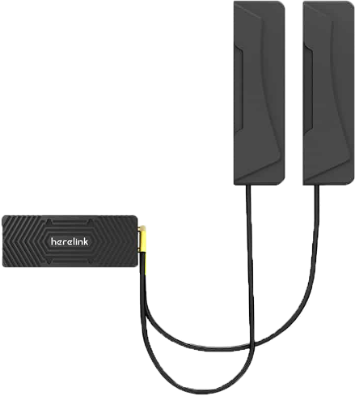
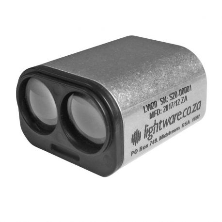
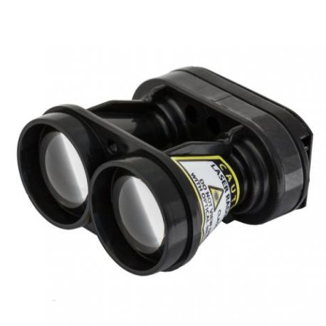
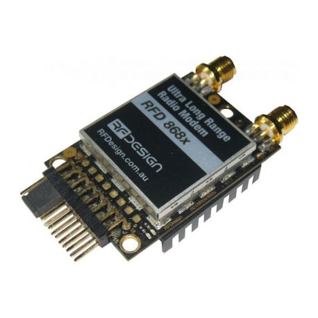
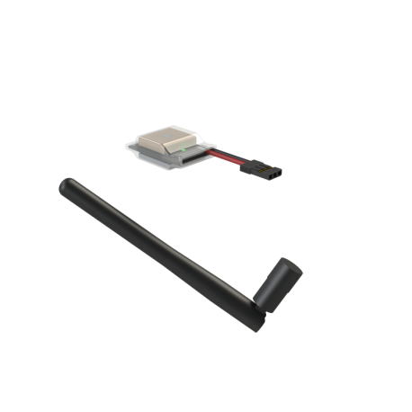

# Les différentes interfaces

## Les interfaces


Il existe 7 interfaces différentes permettant d'utiliser des modules comme présenté ci-après.


## Représentation
### Vue de dessus

### Vue de côté

## Interface A 

* INTERFACE A - Plaque carbone (2mm) pleine
* INTERFACE A - Plaque carbone (2mm) avec deux INTERFACES B (inclus d'origine) 
* INTERFACE A - Plaque carbone (2mm) avec ouverture pour TX2 et une INTERFACE B

## Interface B 

### COVERS
* INTERFACE B - Plaque carbone 1,5mm (inclus d'origine)

### GPS (PRINCIPAL - POSITION DROITE)
#### INTERFACE B - Module Here 3 (HEX) + support + visserie + strobe vert 

<table style=" text-align: left;">
    <tr>
        <th colspan="2" >Description</th>
    </tr>
    <tr>
        <td></td>
        <td>Module intégrant les fonctionnalités de récepteur radio, de transmetteur de données télémétriques. Ce module peut aussi transmettre à la station au sol un retour vidéo en HD. Possède 1 connecteur µ-HDMI, 1 interface USB, 1 JST pour liaison série, 1 JST pour la sortie des données radios</td>
    </tr>
</table>

<table>

    <tr>
        <th colspan="2" style=" text-align: left;">Fonctionnement</th>
    </tr><tr>
        <td>Valim</td><td>7-12V</td>
    </tr><tr>
        <td>Consommation inst. de courant (max)</td><td>3A</td>
    </tr>

    <tr>
        <th colspan="2" style=" text-align: left;">Mécanique</th>
    </tr><tr>
        <td>Dimensions</td><td>76 x 76 x 16,6 mm</td>
    </tr><tr>
        <td>Poids</td><td>48,8 grammes</td>
    </tr><tr>
        <td>Températures de fonctionnement</td><td>-40° à +85° C</td>
    </tr>

     <tr>
        <th colspan="2" style=" text-align: left;">GNSS</th>
    </tr><tr>
        <td>Constellations captées</td><td>GPS L1C/A, GLONASS L1OF, BeiDou B1l </td>
    </tr><tr>
        <td>Processeur</td><td>STM32F302</td>
    </tr><tr>
        <td>Précision</td><td>3D FIX : 2,5 m / RTK : 0,025 m</td>
    </tr><tr>
        <td>Fréquence d'actualisation</td><td>Max : 8 Hz</td>
    </tr><tr>
        <td>Récepteur GPS</td><td>u-blox M8 module GNSS haute précision (M8P)</td>
    </tr><tr>
        <td>IMU</td><td>ICM20948</td>
    </tr>

</table>

#### INTERFACE B - Module GNSS multi-bandes SGPSL12 + support (SHIELD Robotics)

<table style=" text-align: left;">
    <tr>
        <th colspan="2" >Description</th>
    </tr>
    <tr>
        <td></td>
        <td>GNSS conçu en France. En navigation, capable de capter le signal de plus de trente satellites.
            Possibilité de suivre les signaux des constellations GPS, Galileo, Glonass, BeiDou, QZSS. 
            Résistance accrue aux interférences électromagnétiques, augmentant la précision du GPS.</td>
    </tr>
</table>

<table>

    <tr>
        <th colspan="2" style=" text-align: left;">Mécanique</th>
    </tr><tr>
        <td>Dimensions</td><td>60 x 60 x 25 mm</td>
    </tr><tr>
        <td>Poids</td><td>70 grammes</td>
    </tr><tr>
        <td>Températures de fonctionnement</td><td>-40° à +85° C</td>
    </tr><tr>
        <td>LED externe</td><td>Oui, 1</td>
    </tr>

     <tr>
        <th colspan="2" style=" text-align: left;">GNSS</th>
    </tr><tr>
        <td>Constellations captées</td><td>GPS/QZSS GLONASS BeiDou, Galileo</td>
    </tr><tr>
        <td>Bandes GNSS</td><td>L2 / L1 / E5b / B1 / B2</td>
    </tr><tr>
        <td>Précision</td><td>bonne conditions : 50 cm | conditions agitées : < 200 cm </td>
    </tr><tr>
        <td>Fréquence d'actualisation</td><td>20 Hz GNSS</td>
    </tr><tr>
        <td>Récepteur GPS</td><td>SGPSL12</td>
    </tr><tr>
        <td>IMU</td><td>ICM20948</td>
    </tr>

</table>

### SUIVI DE TERRAIN
#### INTERFACE B - Module pour Lidar LW20/C (100m) - LIGHTWARE 

<table style=" text-align: left;">
    <tr>
        <th colspan="2">Description</th>
    </tr>
    <tr>
        <td></td>
        <td>Pour le suivi de terrrain, l'altimètre laser Lidar LW20/C transmet les premiers et derniers signaux pour permettre de distinguer le sommet de la végétation et le niveau du sol simultanément. En ajoutant un petit servo digital, le LW20/C peut être converti en un petit LiDAR capable d'enregistrer 388 points à la seconde lors du scan d'une zone. Idéal pour l'anti-collision et la navigation, le LW20/C peut autant communiquer les données en continu que permettre la prise de décision automatique basée sur des alarmes prédéfinies.</td>
    </tr>
</table>

<table>
    <tr>
        <th colspan="2" style=" text-align: center;" >Spécification</th>
    </tr> <tr>
        <th colspan="2" style=" text-align: left;">Fonctionnement</th>
    </tr><tr>
        <td>Valim</td><td>5V ± 0,5V DC</td>
    </tr><tr>
        <td>Ampérage</td><td>130 mA</td>
    </tr><tr>
        <td>Puissance laser</td><td> < 2 mW</td>
    </tr><tr>
        <td>Sorties et interfaces </td><td>Série et I2C => 3.3V</td>
    </tr>

    <tr>
        <th colspan="2" style=" text-align: left;">Mécanique</th>
    </tr><tr>
        <td>Dimensions</td><td>19,5 x 30,2 x 35 mm</td>
    </tr><tr>
        <td>Poids</td><td>20 g (sans câbles)</td>
    </tr><tr>
        <td>Températures de fonctionnement</td><td>-30 à +40°C</td>
    </tr><tr>
        <td>Lentille</td><td>Verre</td>
    </tr><tr>
        <td>Connectique</td><td>Câble à 5 branches et blindage</td>
    </tr><tr>
        <td>Protection</td><td>IP67</td>
    </tr>

     <tr>
        <th colspan="2" style=" text-align: left;">LIDAR</th>
    </tr><tr>
        <td>Portée</td><td>0,2 - 100 m</td>
    </tr><tr>
        <td>Résolution</td><td>1 cm</td>
    </tr><tr>
        <td>Lectures</td><td>48 - 388 par secondes</td>
    </tr><tr>
        <td>Précision</td><td>± 0,01 m</td>
    </tr><tr>
        <td>Optique</td><td>28 x 15 mm</td>
    </tr><tr>
        <td>Divergence faisceau</td><td>0,3°</td>
    </tr>
</table>

#### INTERFACE B - Module pour Lidar SF30/F (200m) - LIGHTWARE

<table style=" text-align: left;">
    <tr>
        <th colspan="2">Description</th>
    </tr>
    <tr>
        <td></td>
        <td>L'altimètre LiDAR SF30/D dispose d'une portée de 200 mètres pour un poids de seulement 35 grammes. Conçu pour les drones de petites tailles et les véhicules autonomes, cet altimètre laser LiDAR sera idéal pour toutes les applications de type reconnaissance de terrain et évitement d'obstacles. </td>
    </tr>
</table>

<table>
    <tr>
        <th colspan="2" style=" text-align: center;" >Spécification</th>
    </tr> <tr>
        <th colspan="2" style=" text-align: left;">Fonctionnement</th>
    </tr><tr>
        <td>Sorties et interfaces </td><td>Sorties et interfaces </td>
    </tr>

    <tr>
        <th colspan="2" style=" text-align: left;">Mécanique</th>
    </tr><tr>
        <td>Dimensions</td><td>30 x 56,5 x 50 mm</td>
    </tr><tr>
        <td>Poids</td><td>35 g</td>
    </tr><tr>
        <td>Protection</td><td>Ouvert, pas d'IP</td>
    </tr>

     <tr>
        <th colspan="2" style=" text-align: left;">LIDAR</th>
    </tr><tr>
        <td>Portée</td><td>0,2 - 200 m</td>
    </tr><tr>
        <td>Intégration</td><td>API utilisateur, LightWare Studio</td>
    </tr><tr>
        <td>Sécurité</td><td>Emission laser sans danger pour els yeux, classe 1M</td>
    </tr>

</table>

### TELEMETRIE

#### INTERFACE B - Module de télémétrie RFD868x (RFDESIGN) 

<table style=" text-align: left;">
    <tr>
        <th colspan="2">Description</th>
    </tr>
    <tr>
        <td></td>
        <td>Lorem ipsum dolor sit amet, consectetur adipiscing elit. Donec rutrum mi eu libero pellentesque pellentesque a vitae sem. Donec velit leo, sollicitudin id porttitor et, posuere eu tortor. Praesent placerat tellus at est imperdiet egestas. Mauris efficitur sit amet quam id accumsan. Donec vehicula volutpat turpis tempus vulputate. Maecenas varius.</td>
    </tr>
</table>

<table>
    <tr>
        <th colspan="2" style=" text-align: center;" >Spécification</th>
    </tr><tr>
        <td>Frequency Range</td><td>868-869 MHz</td>
    </tr><tr>
        <td>Output Power</td><td>1W (+30dBm)</td>
    </tr><tr>
        <td>Air Data transfer rates</td><td>4, 8, 16, 19, 24, 32, 48, 64 (default), 96, 128, 192 and 250, 500 kbit/sec</td>
    </tr><tr>
        <td>UART data transfer rates</td><td>9600, 19200, 38400, 57600 (default), 115200, 400k, 921k baud</td>
    </tr><tr>
        <td>Output Power</td><td>1W (+30dBm)</td>
    </tr><tr>
        <td>Receive Sensitivity</td><td>>121 dBm at low data rates</td>
    </tr><tr>
        <td>Size</td><td>30 mm (wide) x 57 mm (long) x 12.8 mm (thick)</td>
    </tr><tr>
        <td>Weight</td><td>14.5g</td>
    </tr><tr>
        <td>Mounting</td><td> 3 x M2.5 screws, 3 x header pin solder points</td>
    </tr><tr>
        <td>Power Supply</td><td> +5 V nominal, (+3.5 V min, +5.5 V max), ~800 mA peak at maximum power</td>
    </tr><tr>
        <td>Temp. Range</td><td>Range: -40° to +85°</td>
    </tr>

    <tr>
        <th colspan="2" style=" text-align: left;">Interfaces</th>
    </tr><tr>
        <td>RF</td><td>2 x RP-SMA connectors</td>
    </tr><tr>
        <td>Serial</td><td>Logic level TTL (+3.3v)</td>
    </tr><tr>
        <td>Power</td><td>+5v, ~800mA max peak (at maximum transmit power)</td>
    </tr><tr>
        <td>GPIO</td><td>6 General purpose IO (Digital, ADC, PWM capable)</td>
    </tr>
</table>

#### INTERFACE B - Module de télémétrie RFD900x (RFDESIGN)

<table style=" text-align: left;">
    <tr>
        <th colspan="2">Description</th>
    </tr>
    <tr>
        <td></td>
        <td>Lorem ipsum dolor sit amet, consectetur adipiscing elit. Donec rutrum mi eu libero pellentesque pellentesque a vitae sem. Donec velit leo, sollicitudin id porttitor et, posuere eu tortor. Praesent placerat tellus at est imperdiet egestas. Mauris efficitur sit amet quam id accumsan. Donec vehicula volutpat turpis tempus vulputate. Maecenas varius.</td>
    </tr>
</table>

<table>
    <tr>
        <th colspan="2" style=" text-align: center;" >Spécification</th>
    </tr><tr>
        <td>Frequency Range</td><td> 902 - 928 MHz (USA) / 915 - 928 MHz (Australia)</td>
    </tr><tr>
        <td>Output Power</td><td>1W (+30dBm)</td>
    </tr><tr>
        <td>Air Data transfer rates</td><td> 12, 56, 64 (default), 100, 125, 200, 224, 500 and 750 kbit/sec</td>
    </tr><tr>
        <td>UART data transfer rates</td><td>1200, 2400, 4800, 9600, 19200, 38400, 57600 (default), 115200, 230400, 460800, 1M baud</td>
    </tr><tr>
        <td>Output Power</td><td>1W (+30dBm)</td>
    </tr><tr>
        <td>Receive Sensitivity</td><td>>121 dBm at low data rates</td>
    </tr><tr>
        <td>Size</td><td>25 mm (wide) x 34 mm (long) x 10.4 mm (thick)</td>
    </tr><tr>
        <td>Weight</td><td>10g</td>
    </tr><tr>
        <td>Mounting</td><td> SMT Soldered</td>
    </tr><tr>
        <td>Power Supply</td><td> +5 V nominal, (+3.5 V min, +5.5 V max), ~800 mA peak at maximum power</td>
    </tr><tr>
        <td>Temp. Range</td><td>Range: -40° to +85°</td>
    </tr>

    <tr>
        <th colspan="2" style=" text-align: left;">Interfaces</th>
    </tr><tr>
        <td>RF</td><td>2x u.FL RF connectors</td>
    </tr><tr>
        <td>Serial</td><td>Logic level TTL (+3.3v)</td>
    </tr><tr>
        <td>Power</td><td>+5v, ~800mA max peak (at maximum transmit power)</td>
    </tr><tr>
        <td>GPIO</td><td>General purpose IO (Digital, ADC, PWM capable)</td>
    </tr>
</table>

### IDENTIFICATION
#### INTERFACE B - Module balise d'identification WIFI (DRONAVIA)

<table style=" text-align: left;">
    <tr>
        <th colspan="2">Description</th>
    </tr>
    <tr>
        <td></td>
        <td>Cette balise Zéphyr Beacon Light Pro V2 vous permet de mettre en conformité vos drones s'ils ne sont pas équipés d'un système pas défaut. Sa faible consommation de seulement 40 mA n'impactera pas l'autonomie de vos aéronefs.
        L'antenne permet d'atteindre une portée de 3 km (en conditions optimales) et peux être déportée à l'extérieur du châssis. La balise doit être intégrée à l'intérieur du drone et alimentée par une source en 4,2 V à 8,4 V.  </td>
    </tr>
</table>

<table>
 <tr>
        <th colspan="2" style=" text-align: left;">Spécification</th>
    </tr><tr>
        <td>Sorties et interfaces </td><td>Sorties et interfaces </td>
    </tr><tr>
        <td>Fréquence</td><td>2,4 GHz (2437 MHz)</td>
    </tr><tr>
        <td>Canal WIFI</td><td> 6</td>
    </tr><tr>
        <td>Antenne</td><td>externe</td>
    </tr><tr>
        <td>Portée</td><td>3 km</td>
    </tr><tr>
        <td>Consommation</td><td>40 mA (en moyenne)</td>
    </tr><tr>
        <td>Poids</td><td>23 g</td>
    </tr><tr>
        <td>Tension d'alimentation </td><td>4,2 à 8,4 V</td>
    </tr><tr>
        <td>Dimensions</td><td>30 x 21 x 13 mm + antenne</td>
    </tr>
</table>

### SECOURS
* Pack parachute GALAXY GRS 10-150
    * Parachute GALAXY GRS (10-150) + fixation en aluminium 6061
    * INTERFACE B - Module avec buzzer 110db + interrupteur mécanique
* Module de coupure moteurs PWM - Galaxy GRS 
* Training pyro-actuator - GALAXY GRS
* Toile optionnelle plus performante et plus légère

## Interface C

* INTERFACE C - Plaque carbone 1,5mm (inclus d'origine)
* INTERFACE C - Module avec connecteur XT30 femelle
* INTERFACE C - Module avec câbles 10AWG + XT90 (à souder)
* INTERFACE C - Modules pour antennes HERELINK (gauche et droite)
* INTERFACE C - Module avec USB FISCHER CONNECTORS (livré avec cordon USB)

## Interface D

* INTERFACE D - Plaque carbone 1,5mm (inclus d'origine)
* INTERFACE D - Avec connecteurs JST + cache en PA12
* INTERFACE D - Avec connecteurs JST et passage nappe HDMI + cache en PA12

## Interface E

* INTERFACE E - Support en carbone (1mm) pour module AIR HERELINK

## Interface F

* INTERFACE F - Interfaces de fixation en PA12 pour fixation du TX2 sur la tranche
* INTERFACE F - Support en carbone (2mm) pour Carrier board standard CUBE 2.1

