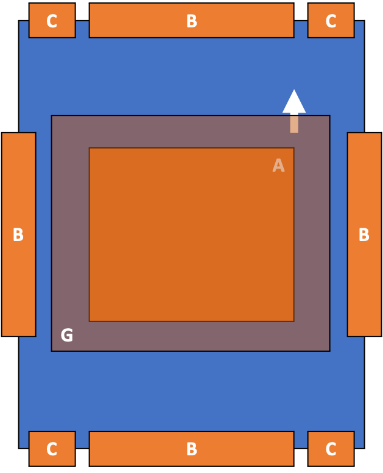

# Les différentes interfaces

## Les interfaces


Il existe 7 interfaces différentes permettant d'utiliser des modules comme présenté ci-après.


## Représentation
### Vue de dessus

### Vue de côté

