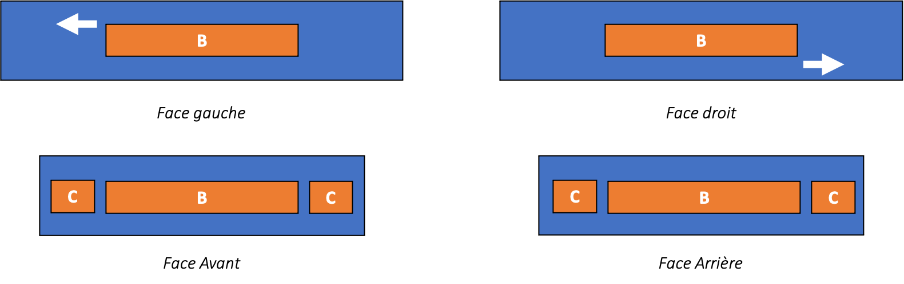

# Les différentes interfaces

## Les interfaces


Il existe 7 interfaces différentes permettant d'utiliser des modules comme présenté ci-après.


## Représentation
### Vue de dessus

### Vue de côté

## Interface D

* INTERFACE D - Plaque carbone 1,5mm (inclus d'origine)
* INTERFACE D - Avec connecteurs JST + cache en PA12
* INTERFACE D - Avec connecteurs JST et passage nappe HDMI + cache en PA12

## Interface E

* INTERFACE E - Support en carbone (1mm) pour module AIR HERELINK

## Interface F

* INTERFACE F - Interfaces de fixation en PA12 pour fixation du TX2 sur la tranche
* INTERFACE F - Support en carbone (2mm) pour Carrier board standard CUBE 2.1

