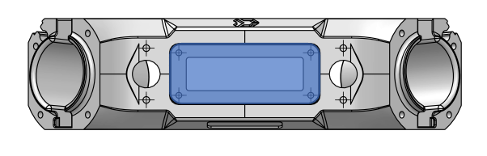

# Les différentes interfaces

## Les interfaces


Il existe 7 interfaces différentes permettant d'utiliser des modules comme présenté ci-après.


## Représentation
### Vue isométrique

<h3>Dessus</h3>

<a href="/INTERFACE/INTERFACEA/interfaceA.html">
    

</a>

<a href="/INTERFACE/INTERFACEG/interfaceG.html">
    

</a>

<h3>Dessous</h3>

<a href="/INTERFACE/INTERFACED/interfaceD.html">
    

</a>

<h3>Les côtés</h3>

<a href="/INTERFACE/INTERFACEB/interfaceB.html">

</a>
<a href="/INTERFACE/INTERFACEC/interfaceC.html">

</a>

<h3>A l'intérieur</h3>

<a href="/INTERFACE/INTERFACEF/interfaceF.html">
    

</a>
<a href="/INTERFACE/INTERFACEE/interfaceE.html">
    

</a>

