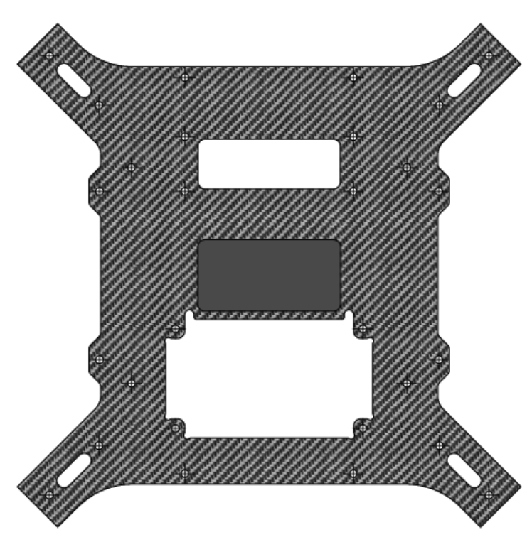

## INTERFACE A - Plaque carbone (2mm) avec ouverture pour TX2 et une INTERFACE B

<table class="description">
    <tr>
        <th colspan="2">Description</th>
    </tr>
    <tr>
        <td></td>
        <td>Lorem ipsum dolor sit amet, consectetur adipiscing elit. Donec rutrum mi eu libero pellentesque pellentesque a vitae sem. Donec velit leo, sollicitudin id porttitor et, posuere eu tortor. Praesent placerat tellus at est imperdiet egestas. Mauris efficitur sit amet quam id accumsan. Donec vehicula volutpat turpis tempus vulputate. Maecenas varius.</td>
    </tr>
</table>
