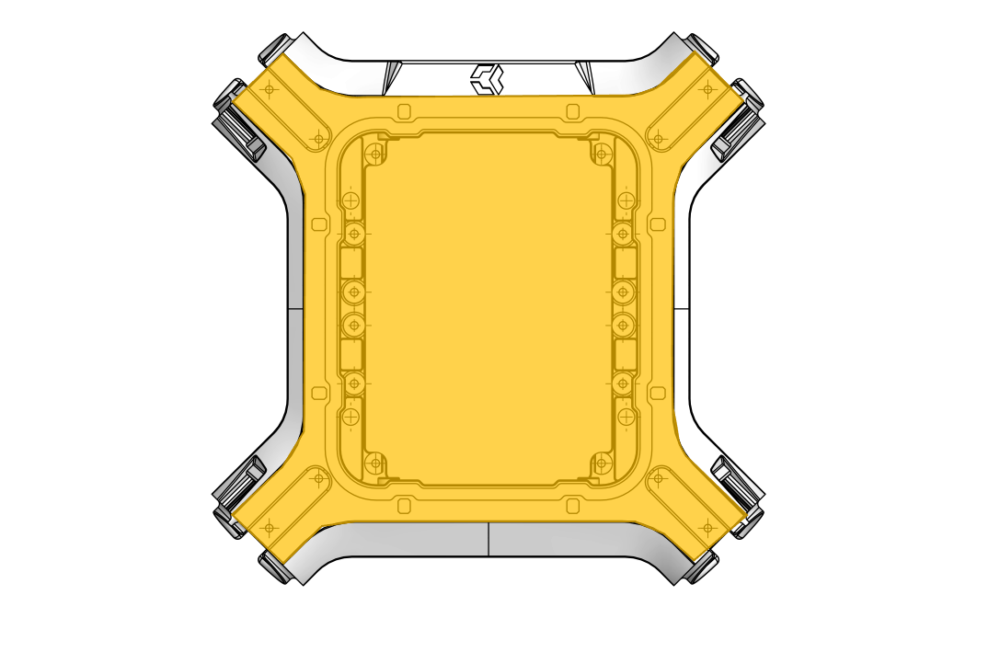

## Interface A 

<table class="interface" style=" text-align: center;">
    <tr>
        <th colspan="2">Vue de dessus</th>
    </tr>
    <tr>
        <td></td>
    </tr>
     <tr>
        <td></td>
    </tr>
    <tr>
        <td>Il existe une seule interface A sur le dessus du drone.</td>        
    </tr>
</table>

<table class="specification">

    <tr>
        <th colspan="2" style=" text-align: left;">Description</th>
    </tr><tr>
        <td>Nombre</td><td>2</td>
    </tr>
    <tr>
        <td>Type</td><td>Plaque</td>
    </tr>
    <tr>
        <td>Matériau</td><td>Fibre de carbone</td>
    </tr>

</table>

Les interfaces A sont des plaques de carbone qui viennent se visser au dessus et en dessous du TUNDRA.
Il existe trois types d'interface A: une plaque carbone pleine, une plaque carbone avec deux interfaces B, et une plaque carbone avec ouverture pour un ordinateur embarqué TX2 et une interface B.
