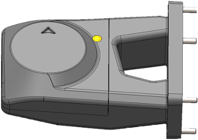

#### INTERFACE B - GPS - Module GNSS multi-bandes SGPSL12 + support (SHIELD Robotics)


Le module GPS se place en position droite du drone.


<table class="description" style=" text-align: left;">
    <tr>
        <th colspan="2" >Description</th>
    </tr>
    <tr>
        <td></td>
        <td>GNSS conçu en France. En navigation, capable de capter le signal de plus de trente satellites.
            Possibilité de suivre les signaux des constellations GPS, Galileo, Glonass, BeiDou, QZSS. 
            Résistance accrue aux interférences électromagnétiques, augmentant la précision du GPS.</td>
    </tr>
</table>

<table class="specification">

    <tr>
        <th colspan="2" style=" text-align: left;">Mécanique</th>
    </tr><tr>
        <td>Dimensions</td><td>60 x 60 x 25 mm</td>
    </tr><tr>
        <td>Poids</td><td>70 grammes</td>
    </tr><tr>
        <td>Températures de fonctionnement</td><td>-40° à +85° C</td>
    </tr><tr>
        <td>LED externe</td><td>Oui, 1</td>
    </tr>

     <tr>
        <th colspan="2" style=" text-align: left;">GNSS</th>
    </tr><tr>
        <td>Constellations captées</td><td>GPS/QZSS GLONASS BeiDou, Galileo</td>
    </tr><tr>
        <td>Bandes GNSS</td><td>L2 / L1 / E5b / B1 / B2</td>
    </tr><tr>
        <td>Précision</td><td>bonne conditions : 50 cm | conditions agitées : < 200 cm </td>
    </tr><tr>
        <td>Fréquence d'actualisation</td><td>20 Hz GNSS</td>
    </tr><tr>
        <td>Récepteur GPS</td><td>SGPSL12</td>
    </tr><tr>
        <td>IMU</td><td>ICM20948</td>
    </tr>

</table>
