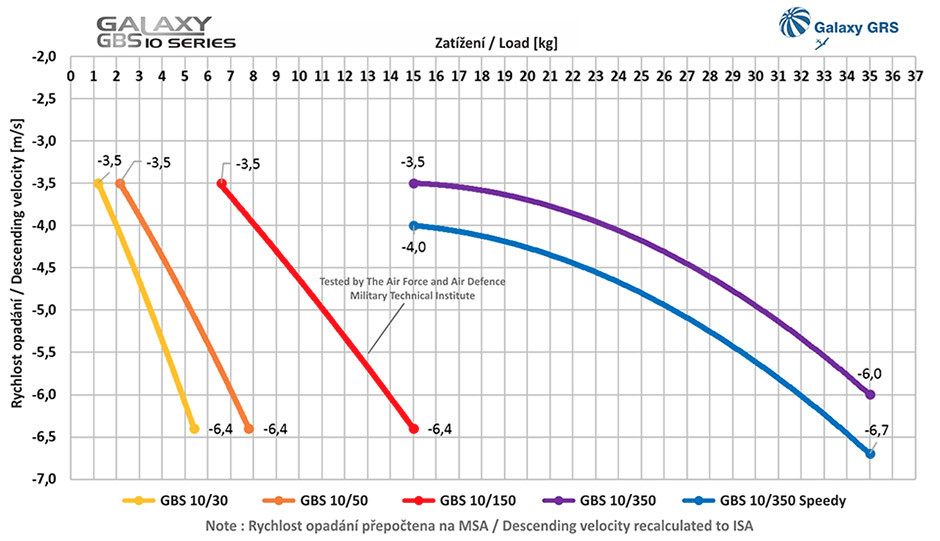

## INTERFACE B - Secours - Pack parachute GALAXY GRS 10-150

* Parachute GALAXY GRS (10-150) + fixation en aluminium 6061
* INTERFACE B - Module avec buzzer 110db + interrupteur mécanique

<table class="description" style=" text-align: left;">
    <tr>
        <th colspan="2">Description</th>
    </tr>
    <tr>
        <td></td>
        <td>La version GALAXY GBS 10/150 est un pack composé d'un parachute à extraction pyrotechnique offrant une solution de secours efficace même à faible hauteur du fait de son temps d'ouverture très rapide (moins d'une seconde) ainsi que d'un coupe circuit (en option) qui coupera les moteurs automatiquement en cas de déclenchement (en version EXTENDED, possible d'y ajouter en option un buzzer). C'est le pack idéal pour faire homologuer votre drone en S3 (type S900 DJI) en moins de 8kg. 
        Compatible avec tous les contrôleurs de vol et récepteurs radio (en PWM).  </td>
    </tr>
</table>

<table class="specification">
 <tr>
        <th colspan="2" style=" text-align: left;">Spécification</th>
    </tr><tr>
        <td>Marque</td><td>Galaxy GRS</td>
    </tr><tr>
        <td>Type d'extraction</td><td>pyrotechnique</td>
    </tr><tr>
        <td>Taille</td><td>100 x 110 mm</td>
    </tr><tr>
        <td>Hauteur d'ouverture minimum</td><td>5 à 8 mètres</td>
    </tr><tr>
        <td>Durée d'ouverture totale</td><td>Jusqu'à 1 seconde</td>
    </tr><tr>
        <td>Poids</td><td>370 grammes ( parachute seul)</td>
    </tr><tr>
        <td>Poids total avec cutter, buzzer, coupe-circuit et carte principale)</td><td>450 grammes</td>
    </tr><tr>
        <td>Pour les drones </td><td>de 5 à 15 Kg</td>
    </tr><tr>
        <td>Température de fonctionnement</td><td>de -20°C à 40°C</td>
    </tr>
</table>

