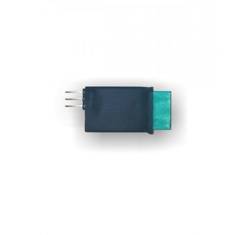

## INTERFACE B - Secours - Training pyro-actuator - GALAXY GRS

<table style=" text-align: left;">
    <tr>
        <th colspan="2">Description</th>
    </tr>
    <tr>
        <td></td>
        <td>Module electrique vous permettant de simuler la charge pyrotechnique afin de valider simplement votre installation. C'est un achat vivement conseillé.</td>
    </tr>
</table>


Présence d'une led qui bascule au rouge quand la charge est activée. Se branche directement sur la sortie "parachute".
