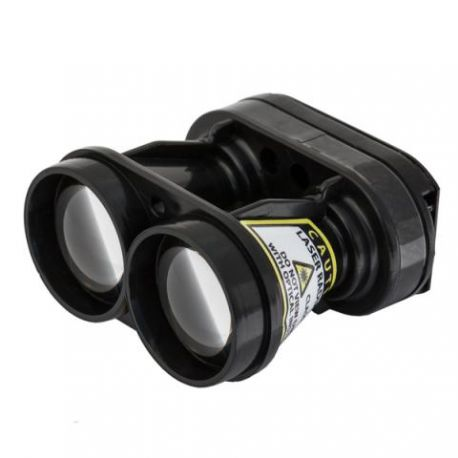

#### INTERFACE B - Suivi de terrain - Module pour Lidar SF30/F (200m) - LIGHTWARE

<table class="description" style=" text-align: left;">
    <tr>
        <th colspan="2">Description</th>
    </tr>
    <tr>
        <td></td>
        <td>L'altimètre LiDAR SF30/D dispose d'une portée de 200 mètres pour un Masse de seulement 35 grammes. Conçu pour les drones de petites tailles et les véhicules autonomes, cet altimètre laser LiDAR sera idéal pour toutes les applications de type reconnaissance de terrain et évitement d'obstacles. </td>
    </tr>
</table>

<table class="specification">
    <tr>
        <th colspan="2" style=" text-align: center;" >Spécification</th>
    </tr> <tr>
        <th colspan="2" style=" text-align: left;">Fonctionnement</th>
    </tr><tr>
        <td>Sorties et interfaces </td><td>Sorties et interfaces </td>
    </tr>

    <tr>
        <th colspan="2" style=" text-align: left;">Mécanique</th>
    </tr><tr>
        <td>Dimensions</td><td>30 x 56,5 x 50 mm</td>
    </tr><tr>
        <td>Masse</td><td>35 g</td>
    </tr><tr>
        <td>Protection</td><td>Ouvert, pas d'IP</td>
    </tr>

     <tr>
        <th colspan="2" style=" text-align: left;">LIDAR</th>
    </tr><tr>
        <td>Portée</td><td>0,2 - 200 m</td>
    </tr><tr>
        <td>Intégration</td><td>API utilisateur, LightWare Studio</td>
    </tr><tr>
        <td>Sécurité</td><td>Emission laser sans danger pour els yeux, classe 1M</td>
    </tr>

</table>