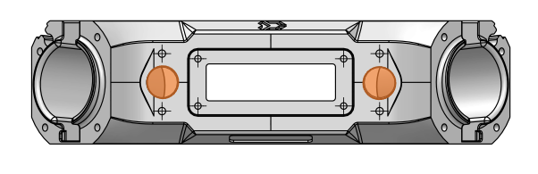

## Interface C 

<table class="interface" style=" text-align: center;">
    <tr>
        <th colspan="2">Vue de face</th>
    </tr>
    <tr>
        <td></td>
    </tr>
    <tr>
        <td>Il existe une 4 interfaces C sur les faces du drone.</td>        
    </tr>
</table>