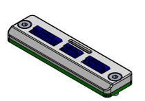

## INTERFACE D - Plaque carbone avec connecteurs JST et passage nappe HDMI

<table class="description" style=" text-align: left;">
    <tr>
        <th colspan="2" >Description</th>
    </tr>
    <tr>
        <td></td>
        <td>PDB</td>
    </tr>
</table>