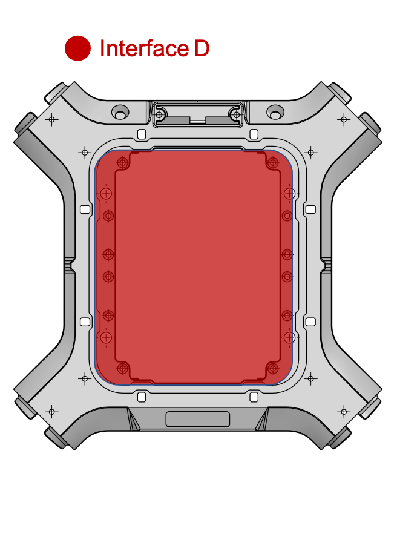

## Interface D

#### INTERFACE D - Plaque carbone 1,5mm (inclus d'origine)

#### INTERFACE D - Avec connecteurs JST + cache en PA12

#### INTERFACE D - Avec connecteurs JST et passage nappe HDMI + cache en PA12

Il existe une 1 interface D sur le dessous du drone.

