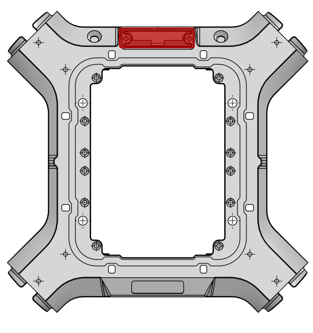

## Interface D

<table class="interface" style=" text-align: center;">
    <tr>
        <th colspan="2">Vue de dessous</th>
    </tr>
    <tr>
        <td></td>
    </tr>
    <tr>
        <td>Il existe une 1 interface D sur le dessous du drone.</td>        
    </tr>
</table>