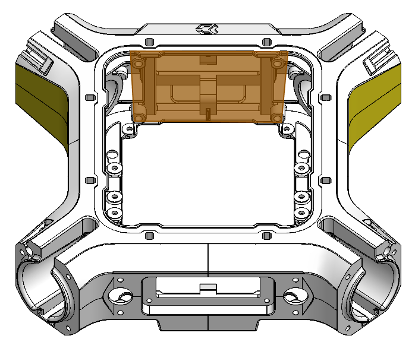

## Interface E

<table class="specification">
<tr>
        <td>Nombre</td><td>2</td>
    </tr><tr>
        <td>Type</td><td>Ouverture</td>
    </tr><tr>
        <td>Matériau</td><td>PA12</td>
    </tr>
</table>

<table class="interface">
    <tr>
        <td class="image"></td>
        <td class="image"></td>
    </tr>
</table>

Les interfaces B sont des ouvertures localisées à l'avant et l'arrière du drone ainsi que sur les cotés. Certaines interfaces A sont elles-mêmes constitués d'interface B, ainsi on peut retrouver jusqu'à 8 interfaces B en fonction de l'interface A choisie.
Les interfaces B permettent de connecter différents modules tels que des GPS, des balises d'identification, des modules de parachute, des modules Lidar, des modules de télémétrie et bien d'autres...