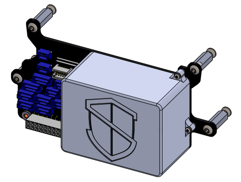

#### INTERFACE F - Support en carbone (2mm) pour Carrier board standard CUBE 2.1

<table class="description" style=" text-align: left;">
    <tr>
        <th colspan="2" >Description</th>
    </tr>
    <tr>
        <td></td>
        <td>Cube de shield robotics</td>
    </tr>
</table>

