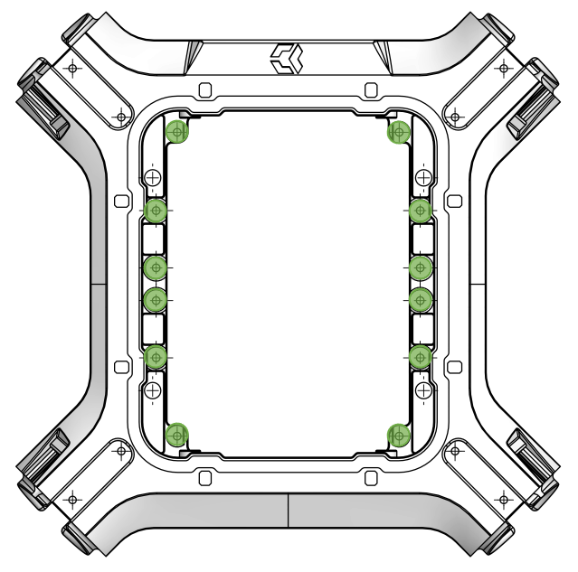

## Interface F

<table class="specification">
<tr>
        <td>Nombre</td><td>12</td>
    </tr><tr>
        <td>Type</td><td>Ouverture</td>
    </tr><tr>
        <td>Matériau</td><td>PA12</td>
    </tr>
</table>

<table class="interface">
    <tr>
        <td ></td>
    </tr>
</table>

Les interfaces F se situent à l'intérieur du drone dans la partie inférieure. Ces interfaces permettent l'intégration de composants électroniques, notamment le PCB  du Cube.