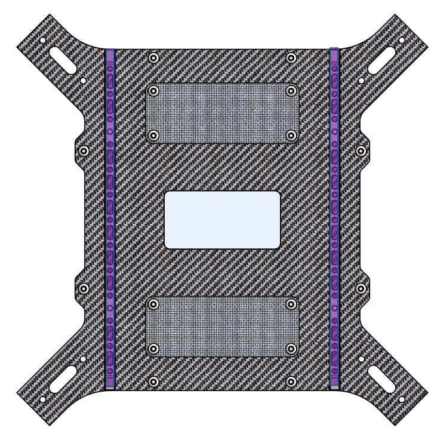

## Interface G

<table class="specification">
<tr>
        <td>Nombre</td><td>2</td>
    </tr><tr>
        <td>Type</td><td>Rail</td>
    </tr><tr>
        <td>Matériau</td><td>Inox</td>
    </tr>
</table>

<table class="interface">
    <tr>
        <td class="image"></td>
    </tr>
</table>

Les interfaces G sont des rails en inox vissés sur les interfaces A. On peut y intégrer principalement des supports pour sangle Cobra, des adaptations pour batterie ou alors des adaptations pour module Elistair.