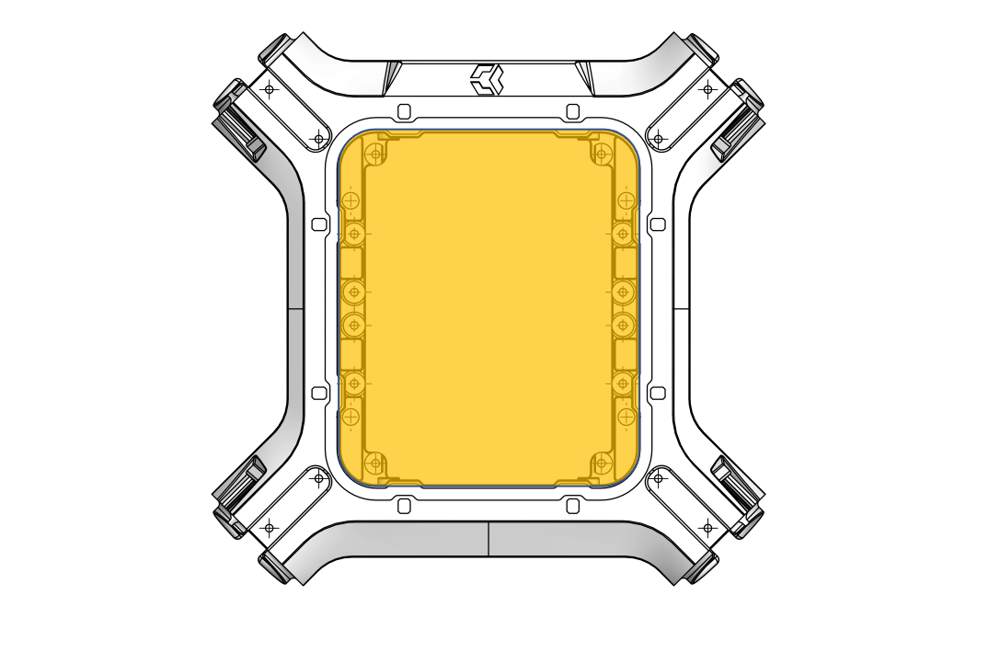
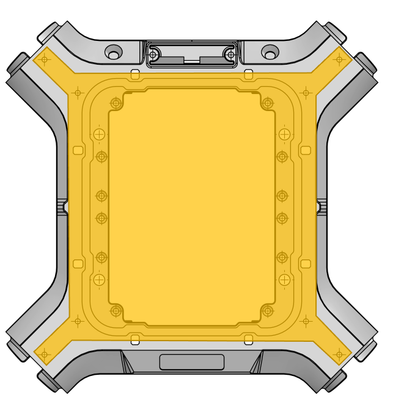

## Interface A 

<table class="specification">
<tr>
        <td>Nombre</td><td>2</td>
    </tr><tr>
        <td>Type</td><td>Plaque</td>
    </tr><tr>
        <td>Matériau</td><td>Fibre de carbone</td>
    </tr>
</table>

<table class="interface">
    <tr>
        <td class="image"></td>
        <td class="image"></td>
    </tr>
</table>

Les interfaces A sont des plaques de carbone qui viennent se visser au dessus et en dessous du TUNDRA.
Il existe trois types d's A.

  

<a class="card-intro card-intro-small module" style="text-align: center;" href="/INTERFACE/INTERFACEA/COVERS/COVERS_PLEINE.html">
<h3>Plaque carbone pleine</h3>
</a>

<a class="card-intro card-intro-small module" href="/INTERFACE/INTERFACEA/COVERS/COVERS_2INTB.html">
<h3>Plaque carbone avec deux interfaces B</h3>
</a>

<a class="card-intro card-intro-small module" href="/INTERFACE/INTERFACEA/COVERS/COVERS_1INTBTX2.html">
<h3>Plaque carbone avec ouverture pour un ordinateur embarqué TX2 et une interface B</h3>
</a>

  

