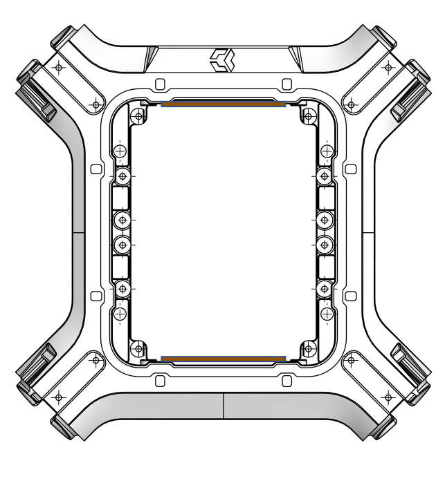
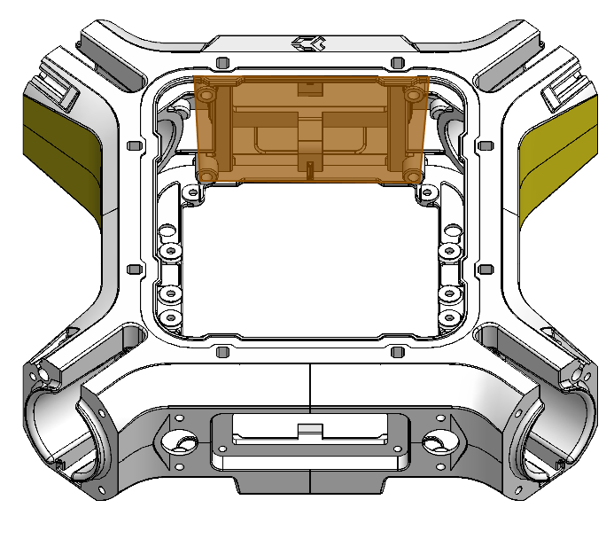

## Interface E

<table class="specification">
<tr>
        <td>Nombre</td><td>2</td>
    </tr><tr>
        <td>Type</td><td>Ouverture</td>
    </tr><tr>
        <td>Matériau</td><td>PA12</td>
    </tr>
</table>

<table class="interface">
    <tr>
        <td class="image"></td>
        <td class="image"></td>
    </tr>
</table>

Les interfaces E se situent dans la partie intérieure du châssis à l'avant et à l'arrière. On peut y intégrer des modules électroniques comme par exemple un Cube, une PDB ou un Herelink.